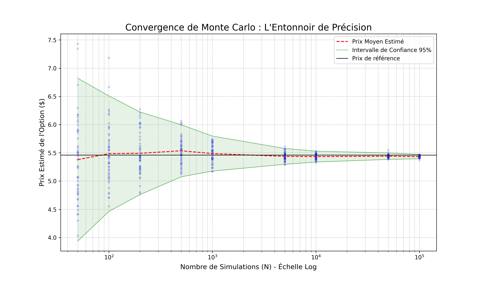
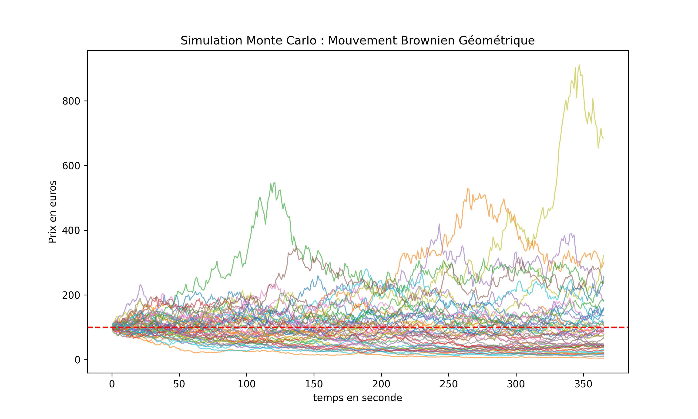

# High-Performance Monte Carlo Pricing Engine (C++20)


## 🚀 Project Overview

This project is a high-performance, **Event-Driven Monte Carlo simulation engine** designed for pricing complex financial derivatives. 

Unlike standard "for-loop" implementations, this engine uses a decoupled architecture (Scheduler/Engine) and advanced C++20 memory management features to achieve low latency and high throughput. It supports **Stochastic Volatility models (Heston)** and **Path-Dependent Options (Barriers)** with continuous monitoring corrections.

### Key Features
* **Event-Driven Architecture:** Decouples the mathematical model from the time-stepping logic, allowing for flexible instrument structuring.
* **Low-Latency Optimization:** Utilizes **`std::pmr` (Polymorphic Memory Resources)** and custom **Memory Pools** to minimize heap allocations and memory fragmentation during runtime.
* **Lock-Free Concurrency:** Implements a thread-safe architecture using `thread_local` storage and `std::future`, saturating CPU cores without mutex contention.
* **Exotic Pricing:** Includes **Brownian Bridge** techniques to correct discretization bias for Barrier Options.

---

## 📊 Performance & Visualization

The engine includes Python scripts for statistical analysis, validating convergence ($\frac{1}{\sqrt{N}}$) and visualizing volatility surfaces.

### Monte Carlo Convergence (Funnel Plot)
*Demonstration of numerical stability and variance reduction as $N$ increases.*

 
*(Note: Replace with the path to your convergence graph)*

### Heston Model Paths
*Simulation of spot prices with stochastic volatility ($S_0=100, \kappa=2.0, \xi=0.3, \rho=-0.7$).*



---

## 🛠️ Technical Architecture

### 1. Memory Management (`std::pmr`)
To achieve high frequency performance, the engine avoids the overhead of `new`/`malloc` inside the simulation loop.
* **Custom Allocator:** `SafePoolThread` manages a monotonic buffer resource.
* **Cache Locality:** Data is allocated contiguously, improving CPU cache hit rates.

### 2. The Engine Core
* **Scheduler:** Manages a priority queue of events sorted by execution time.
* **Event Loop:** Processes events (Price Update, Cashflow, Barrier Check) sequentially within each thread, ensuring deterministic execution for a given seed.

### 3. Models Implemented

#### Geometric Brownian Motion (Black-Scholes)
$$dS_t = \mu S_t dt + \sigma S_t dW_t$$

#### Heston Stochastic Volatility Model
Designed to capture the "volatility smile" and fat tails observed in markets:
$$dS_t = \mu S_t dt + \sqrt{v_t} S_t dW_t^S$$
$$dv_t = \kappa (\theta - v_t) dt + \xi \sqrt{v_t} dW_t^v$$
where $dW_t^S$ and $dW_t^v$ are correlated with correlation $\rho$.

---

## 💻 Installation & Usage

### Prerequisites
* C++ Compiler supporting **C++20** (GCC 10+, Clang 10+, MSVC 19.28+)
* CMake 3.10+
* Python 3.x (for visualization only: `pandas`, `matplotlib`, `numpy`)

### Build Instructions

```bash
# Clone the repository
git clone [https://github.com/YOUR_USERNAME/cpp-pricing-engine.git](https://github.com/YOUR_USERNAME/cpp-pricing-engine.git)
cd cpp-pricing-engine

# Create build directory
mkdir build && cd build

# Configure and Build (Release mode recommended for performance)
cmake -DCMAKE_BUILD_TYPE=Release ..
make -j4# Multi-Thead-C-Engine
